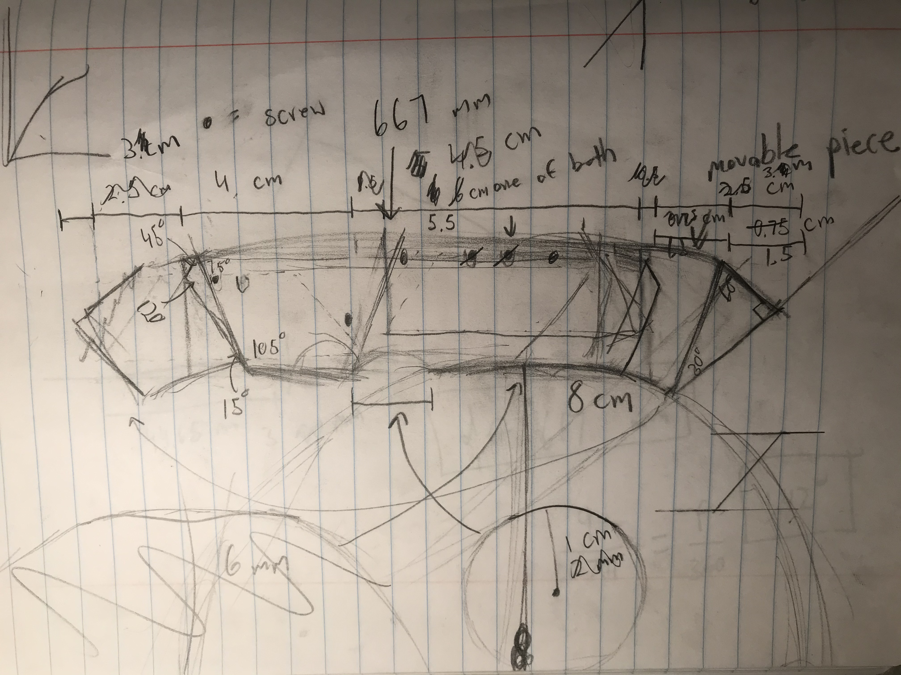
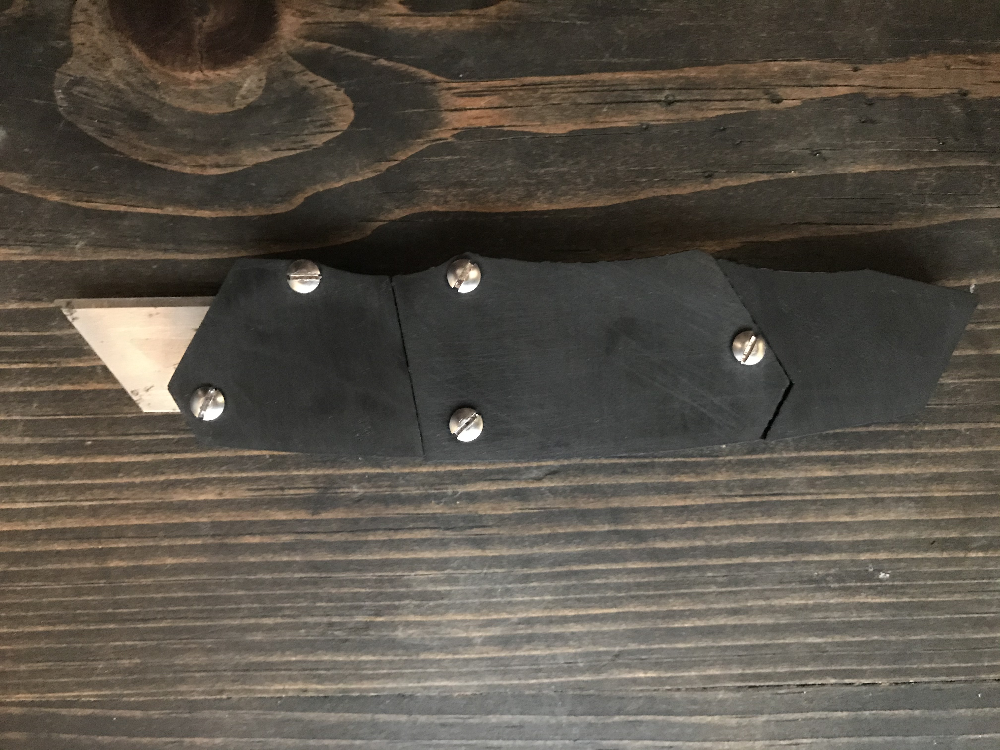
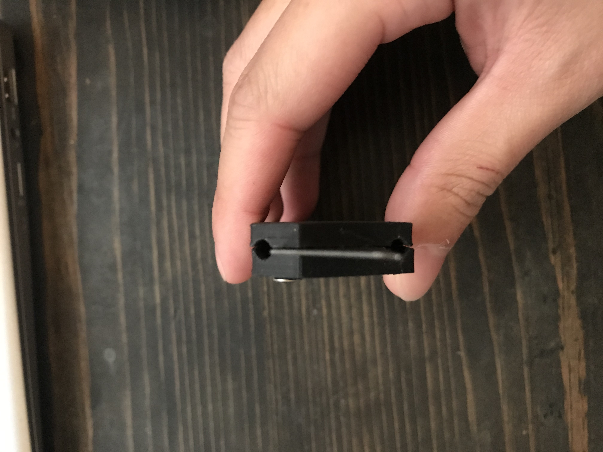

# 3D Printed Utility Knife
During my first year of college, I started to work on a project to make my very own utility knife. There were two reasons for doing this 1) I wanted to learn how to using Solidworks to create complex multi piece designs and 2) Every mechanical engineer needs a utility knife!

## Sketching
I started by doing some quick sketches. I had a rough idea of what I wanted when I started this project, but I wanted to have something concrete and organized to make it easier to CAD. **Requirements Here**

<figcaption align = "center"><b>Utility Knife Concept Idea</b></figcaption>

<figcaption align = "center"><b>Utility Blade Dimensions</b></figcaption>

<figcaption align = "center"><b>Utility Knife Rough Dimensions</b></figcaption>

## CADing

**CAD progression here**

## 3D Printing

### Prusaslicer & Troubleshooting

## Finished Product

<figcaption align = "center"><b></b></figcaption>

<figcaption align = "center"><b></b></figcaption>

<figcaption align = "center"><b></b></figcaption>

<figcaption align = "center"><b></b></figcaption>

<figcaption align = "center"><b></b></figcaption>

<figcaption align = "center"><b></b></figcaption>

## Final Remarks
