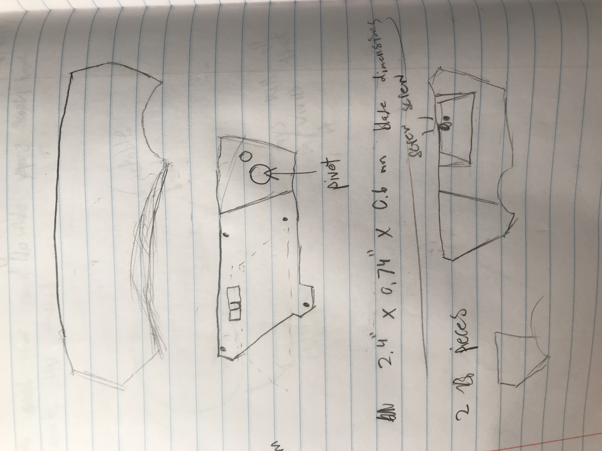
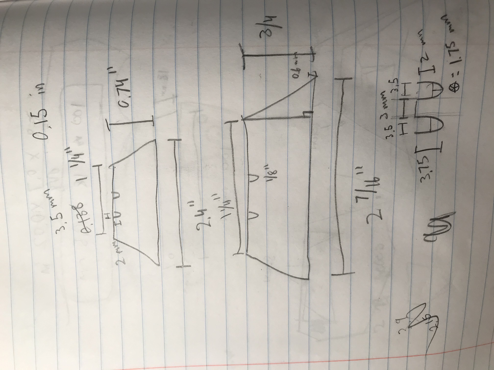
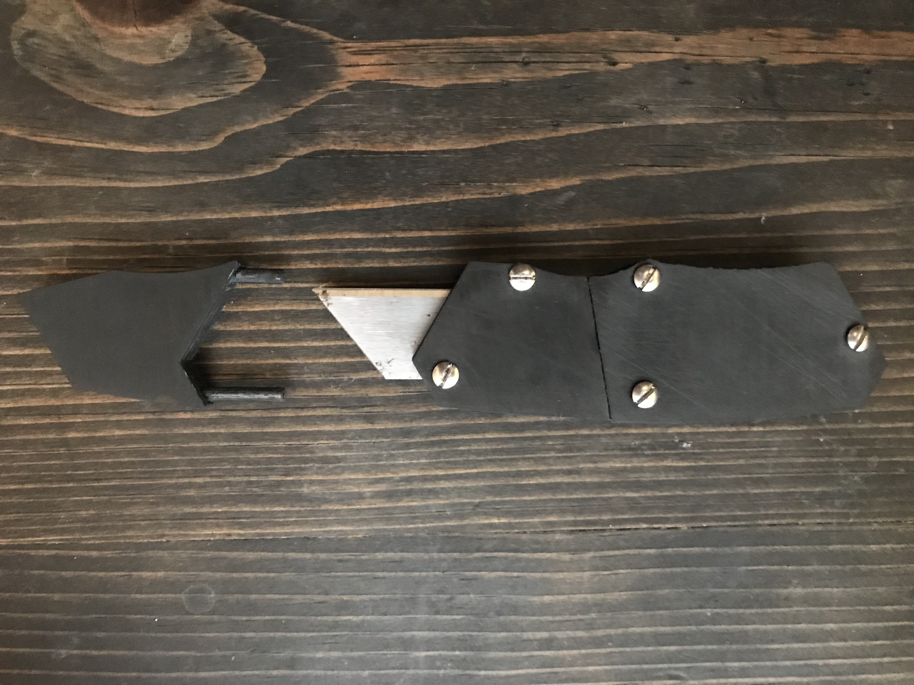
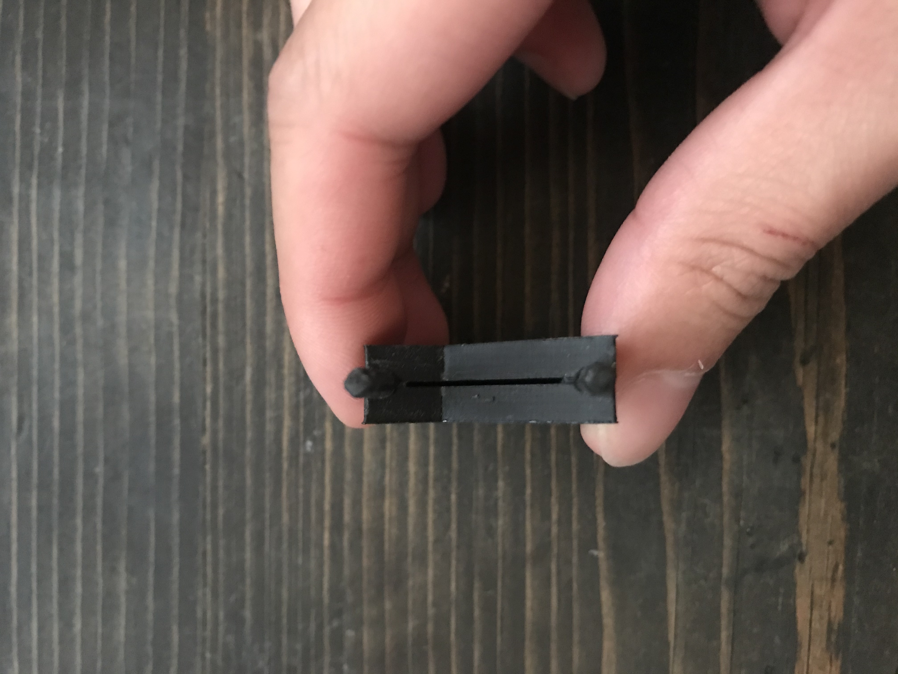

# 3D Printed Utility Knife
During my first year of college, I started to work on a project to make my very own utility knife. There were two reasons for doing this 1) I wanted to learn how to using Solidworks to create complex multi piece designs and 2) Every mechanical engineer needs a utility knife!

## Sketching
I started by doing some quick sketches. I had a rough idea of what I wanted when I started this project, but I wanted to have something concrete and organized to make it easier to CAD. I wanted a simple mechanism to keep the knife blade safe so it could be 3D printed easily, so I decided to create a two pins that can be inserted into pinholes on either side of the knife. The pins and pinholes have a force fit, which keeps them from falling out.

<figcaption align = "center"><b>Utility Knife Concept Idea</b></figcaption>

<figcaption align = "center"><b>Utility Blade Dimensions</b></figcaption>

<figcaption align = "center"><b>Utility Knife Rough Dimensions</b></figcaption>

## CADing

After getting some basic information, such as rough knife dimensions and blade dimensions, I began CADing the parts. I first created the large one piece body as can be seen below.

**One Piece Body Here**

After creating this part, I made two copies of this and split the one body into two pieces as can be seen below.

**Two Piece Body Here**

Once I have the main body, I made an assembly with the blade to build a cover around the blade. After that was done, I created pins and pinholes for them.

**CAD progression here**

## 3D Printing

### Prusaslicer & Troubleshooting

## Finished Product

<figcaption align = "center"><b></b></figcaption>

<figcaption align = "center"><b></b></figcaption>

<figcaption align = "center"><b></b></figcaption>

<figcaption align = "center"><b></b></figcaption>

<figcaption align = "center"><b></b></figcaption>

<figcaption align = "center"><b></b></figcaption>

## Final Remarks
