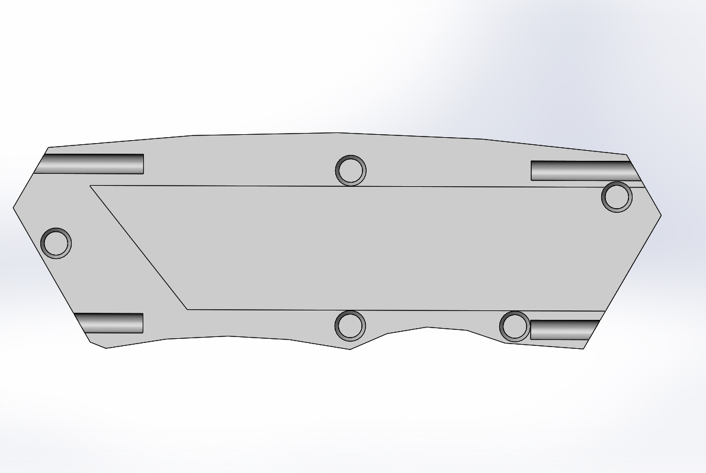

# 3D Printed Utility Knife
During my first year of college, I started to work on a project to make my very own utility knife. There were two reasons for doing this 1) I wanted to learn how to using Solidworks to create complex multi piece designs and 2) Every mechanical engineer needs a utility knife!

## Sketching
I started by doing some quick sketches. I had a rough idea of what I wanted when I started this project, but I wanted to have something concrete and organized to make it easier to CAD. I wanted a simple mechanism to keep the knife blade safe so it could be 3D printed easily, so I decided to create a two pins that can be inserted into pinholes on either side of the knife. The pins and pinholes have a force fit, which keeps them from falling out.

<figcaption align = "center"><b>Utility Knife Concept Idea</b></figcaption>

<figcaption align = "center"><b>Utility Blade Dimensions</b></figcaption>

<figcaption align = "center"><b>Utility Knife Rough Dimensions</b></figcaption>

## CADing

After getting some basic information, such as rough knife dimensions and blade dimensions, I began CADing the parts. I first created the large one piece body as can be seen below.

<figcaption align = "center"><b>Main One Piece Body (Iso)</b></figcaption>

<figcaption align = "center"><b>Main One Piece Body (Top View)</b></figcaption>

After creating this part, I made another copy of this and split it into two pieces as can be seen below.

<figcaption align = "center"><b>Main Body (1/2)</b></figcaption>

<figcaption align = "center"><b>Main Body (2/2)</b></figcaption>

Once I have the main body, I made an assembly with the blade to build a cover around the blade. After that was done, I created pins and pinholes for them.

<figcaption align = "center"><b>Final Assembly (Open)</b></figcaption>

<figcaption align = "center"><b>Final Assembly (Closed)</b></figcaption>

## 3D Printing

For the print material, I chose ABS plastic because it is strong yet flexible. With the way I designed the cap insert, this allows for some degree of bending without breaking.

### Prusaslicer & Troubleshooting

The print took about 2 hrs and 30 mins with a infill of 15%. All of this was sliced in PrusaSlicer. While printing, there were a couple of times the print lifted off the heatbed. This was solved by adding a brim (a layer of material around a part to increase adhesion to headbed) and increasing the heatbed temperature to reduce contraction of material.

<figcaption align = "center"><b>PrusaSlicer</b></figcaption>

## Finished Product

<figcaption align = "center"><b></b></figcaption>

<figcaption align = "center"><b></b></figcaption>

<figcaption align = "center"><b></b></figcaption>

<figcaption align = "center"><b></b></figcaption>

<figcaption align = "center"><b></b></figcaption>

<figcaption align = "center"><b></b></figcaption>

## Final Remarks

I enjoyed working on this project a lot. I have always wanted to make something that I can use and carry around with me! Next time, I might want to redesign it so that I could machine it out of metal instead. The reason this knife wasn't made out of metal is because of how hard it would be to machine the pins to the exact size so that they fit nicely without being too loose or tight. In this project, I was able use what I learned aobut SolidWorks and apply it.