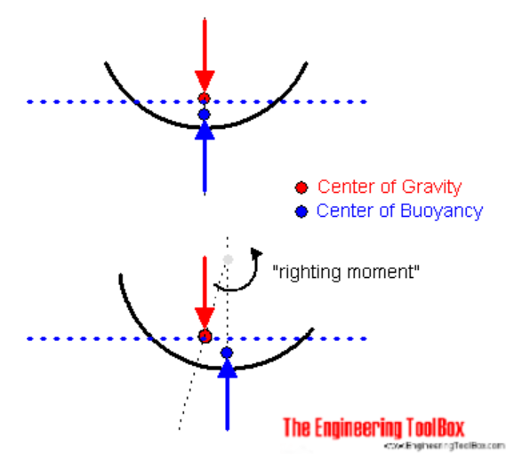
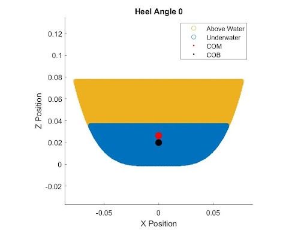
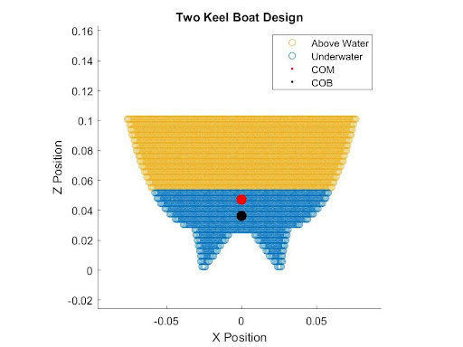
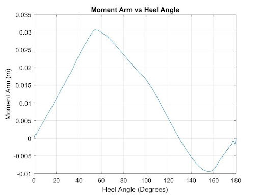
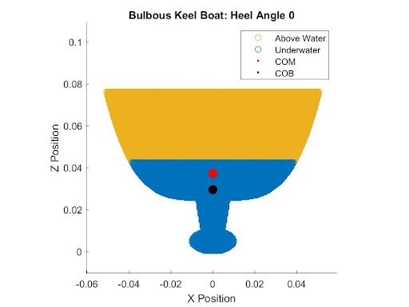
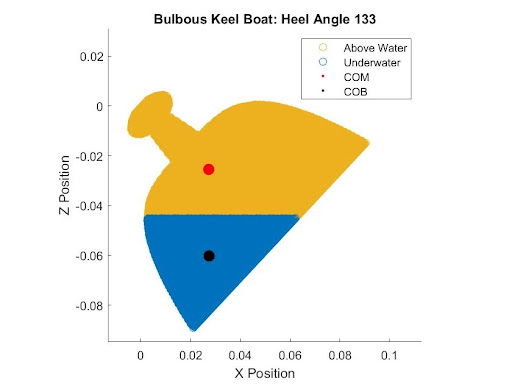
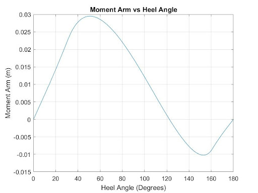

# Boat Project
In this project, me and my partner designed a monohull boat using mathematical analysis to produce a boat that fits a set of requirements and create a SolidWorks model to be 3D printed. This project was made in our Quantative Engineering Analysis (QEA) class in the spring of 2021.

**Requirements**  
* Boat must be parallel to the surface of the water (5 degrees offset)
* Boat must be monohull
* Boat must have a flat deck
* Boat must float
* Boat must fit within a 6" x 6" x 3" volume (volume of build plate)
* Boat must have an angle of vanishing  (AVS) between 120 and 140 degrees

The requirements are there in order to constrain and/or simplify this project. For example, there are many different hull designs we could try to model and simulate but it would add a lot more complexity and go beyond the scope of this project.

## Modelling and Simulation

We used MATLAB to model the center of mass (COM) and center of buoyancy (COB) over a variety of angles given a set of parameters. Our parameters that we can change include the width, height, and length of our boat in meters. We can also modify the densities of different sections of the boat. These parameters directly effect the COM and COB, which allows us to calculate the behavior of our boat depending on what angle the boat is rotated by. First we had to find the waterline when the boat is at stable equilibrium. We are able to calculate this by finding when the force of gravity is equal to the buoyancy force which is equivalent to the weight of the water displaced by the boat. Once we know these these two forces we can find the righting moment that is created when the center of gravity and center of buoyancy are not vertically alligned. Below is a good picture that shows this effect. We can then find the angle of vanishing (AVS) using a moment vs heel angle graph. The angle of vanishing is determined when the righting moment is zero but there is no restoring force that allows the boat to return this point. We then optimized our design by doing a parameter sweep on how much of the bottom of the boat is solid. Finally, we created a CAD model using a equation driven curve.

<figcaption align = "center"><b>[Engineering Tool Box](https://www.engineeringtoolbox.com/centre-gravity-buoyancy-d_1286.html)</b></figcaption>

## Minimum Viable Product

We made a our minimum viable product (MVP) first before making a more complex boat in the case that something goes awry. Our MVP is a boat modelled using the equation *f(x)=x4*. As you can see from the images below, the boat meets all the requirements with an AVS of 122 degrees. 

<figcaption align = "center"><b>Cross-sectional view of the boat with the heel of zero degrees at the waterline</b></figcaption>

<figcaption align = "center"><b>Righting Moment Arm vs Heel Angle Graph (clockwise is positive)</b></figcaption>

## Two Keel Design

After we made our MVP, we decided to make a more complicated design. We did this by adding two triangular keels. We modelled this boat using four lines rotated at an angle to form the two keels and the equation we had above. We found the AVS to be 123 degrees.

<figcaption align = "center"><b>Cross-sectional view of the boat with the heel of zero degrees at the waterline</b></figcaption>

<figcaption align = "center"><b>Righting Moment Arm vs Heel Angle Graph (clockwise is positive)</b></figcaption>

## One Keel Bulb Design

Unsatisfied with our AVS for our two keel design, we decided to pivot to a one keel design with a solid bulb at the end. By doing so, more mass would be at the bottom of the boat which cause the center of mass to be further down the boat resulting in a restoring force at higher angles. The keel uses three equations, a parabola, an ellipse, and the equation we used in our MVP:   

The parabola has the function *f(x)=0.5x2*    
The ellipse has the function *f(x)=$\sqrt{25*(1-((x2)/100))}$*

Our optimized boat had a 100% infill 30 mm from the bottom of the bottom with the top being 15% and achieved an AVS of 134 degrees. And so this was the design we decided to 3D print.

<figcaption align = "center"><b>Cross-sectional view of the boat with the heel of zero degrees at the waterline</b></figcaption>

<figcaption align = "center"><b>Graph of the with an AVS of 134 degrees. We know the boat is at equilibrium because the COM and COB are vertically aligned. It is unstable because there is no restoring force when you turn the boat cw or ccw that returns the boat to this position.</b></figcaption>

<figcaption align = "center"><b>Righting Moment Arm vs Heel Angle Graph (clockwise is positive)</b></figcaption>

<figcaption align = "center"><b>Final Render of Design</b></figcaption>

## Final Remarks

Unfortunately, no videos were taken of our boat floating. 

