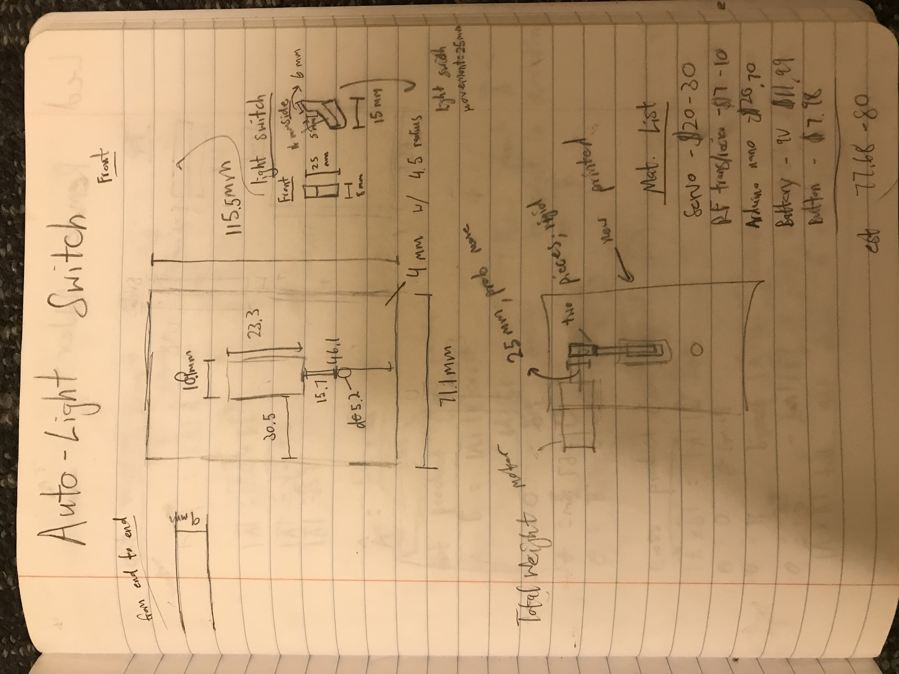
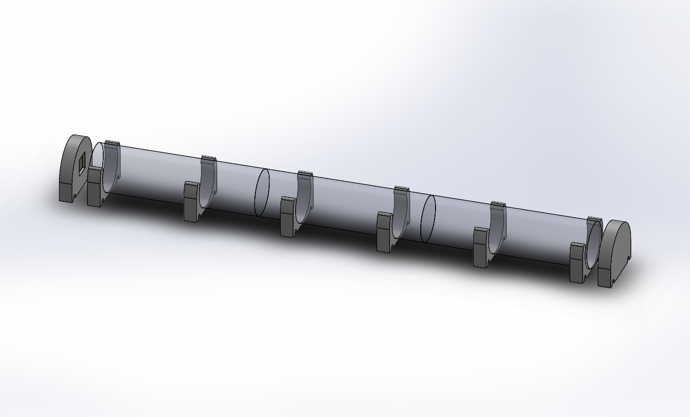
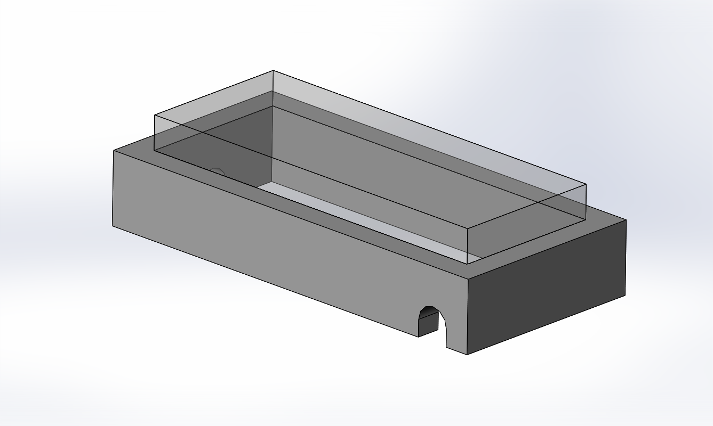
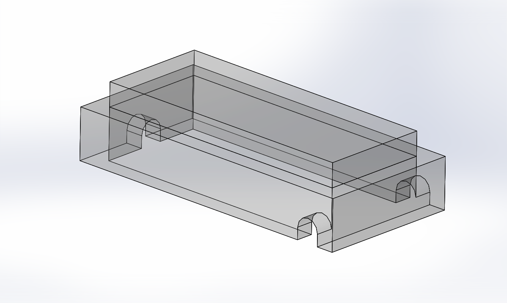
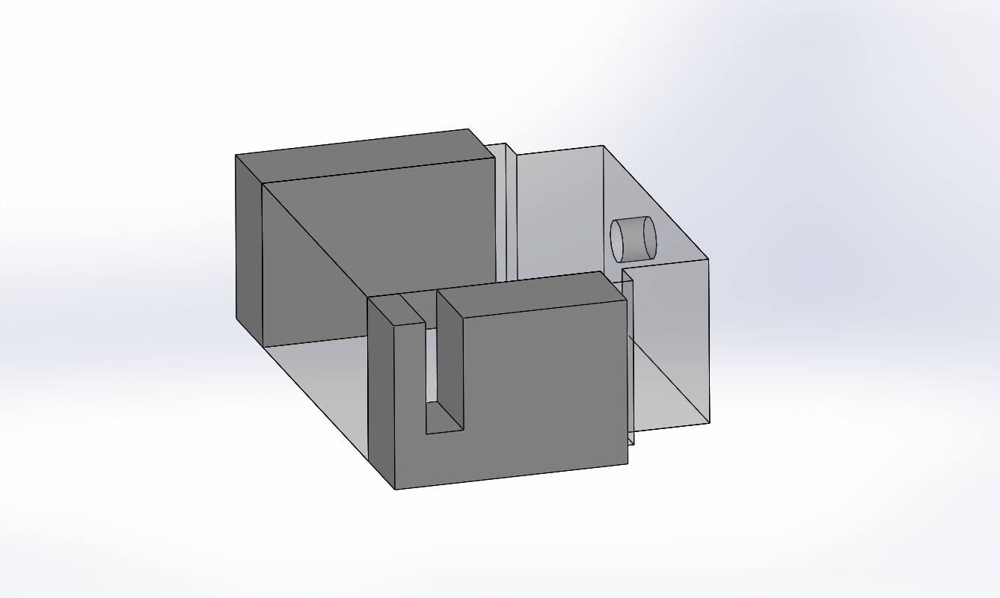
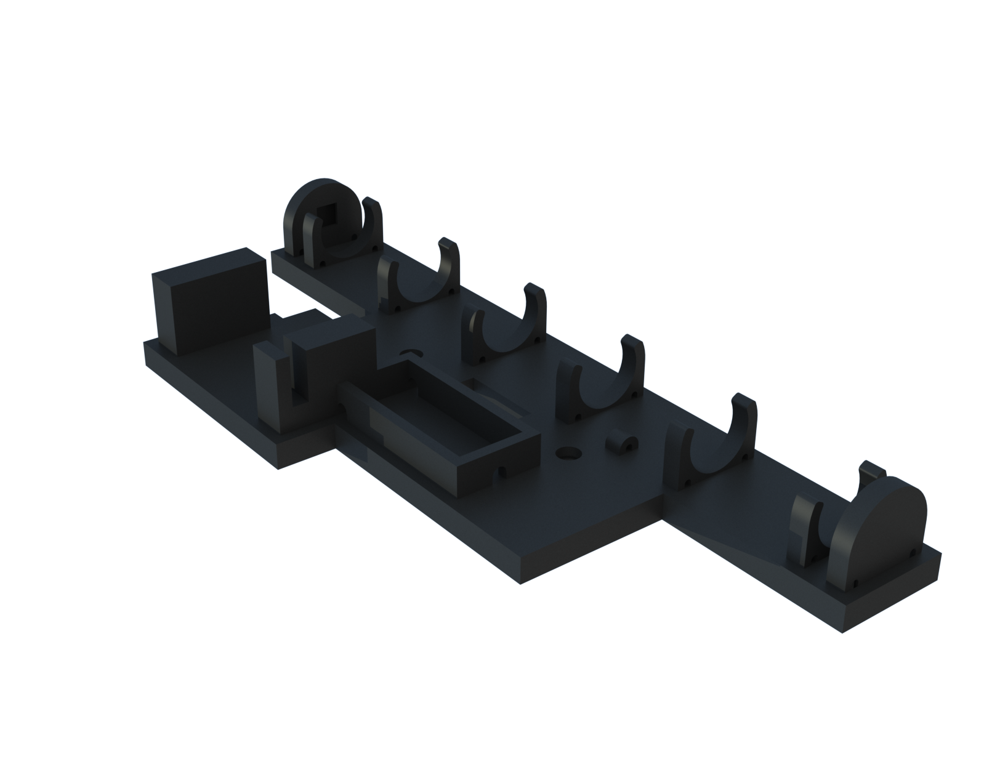
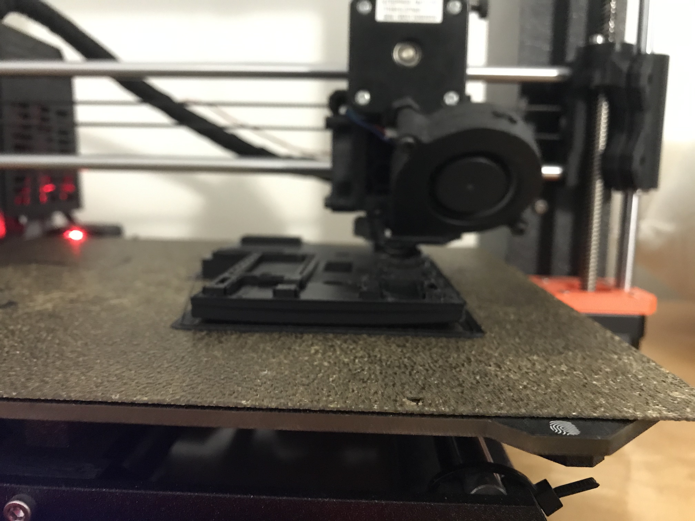
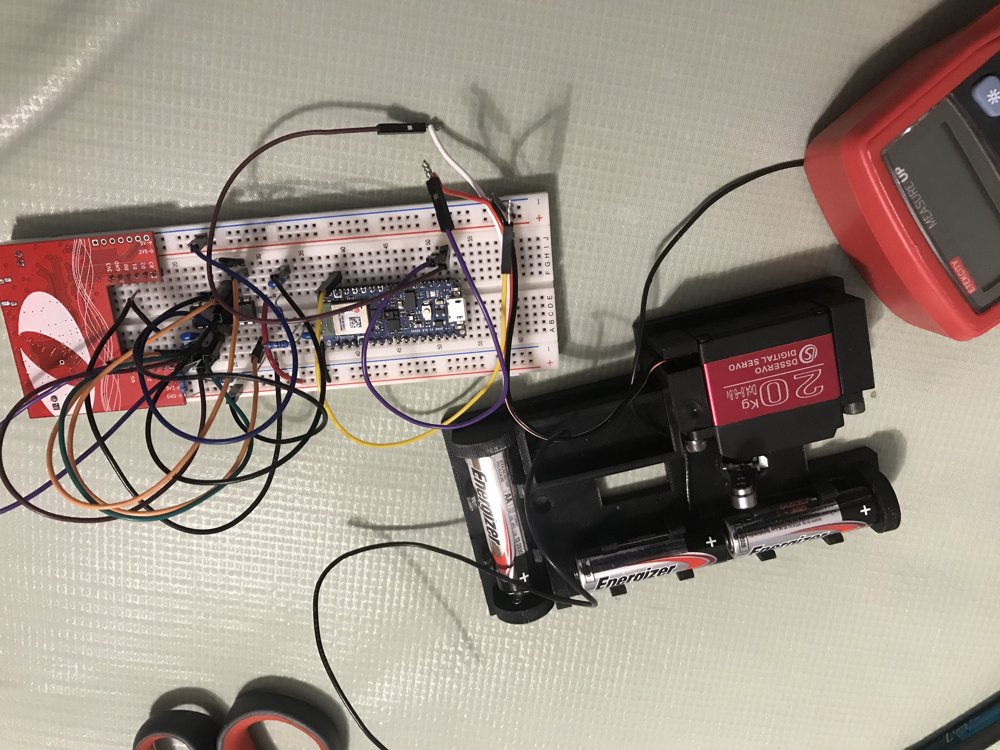
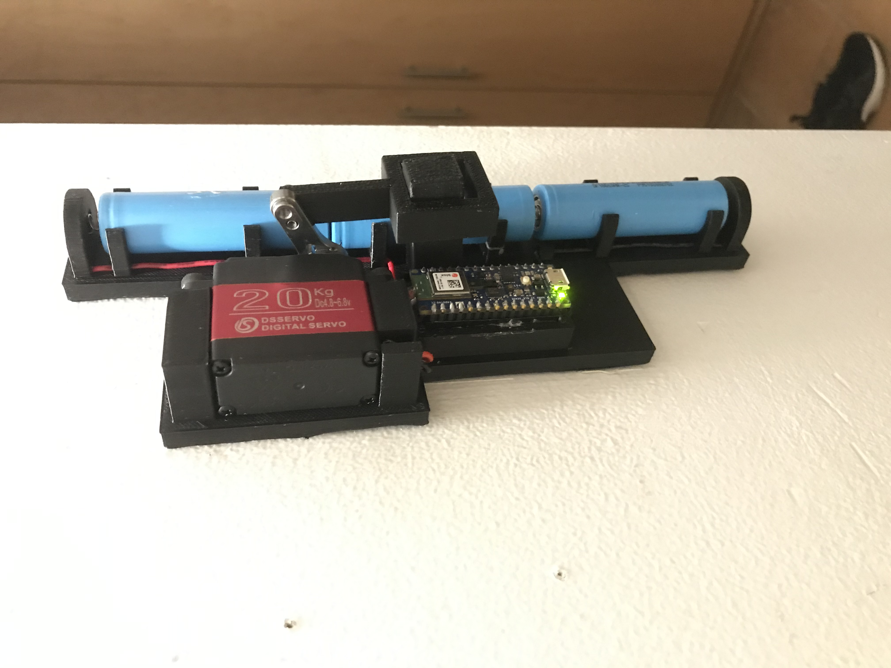
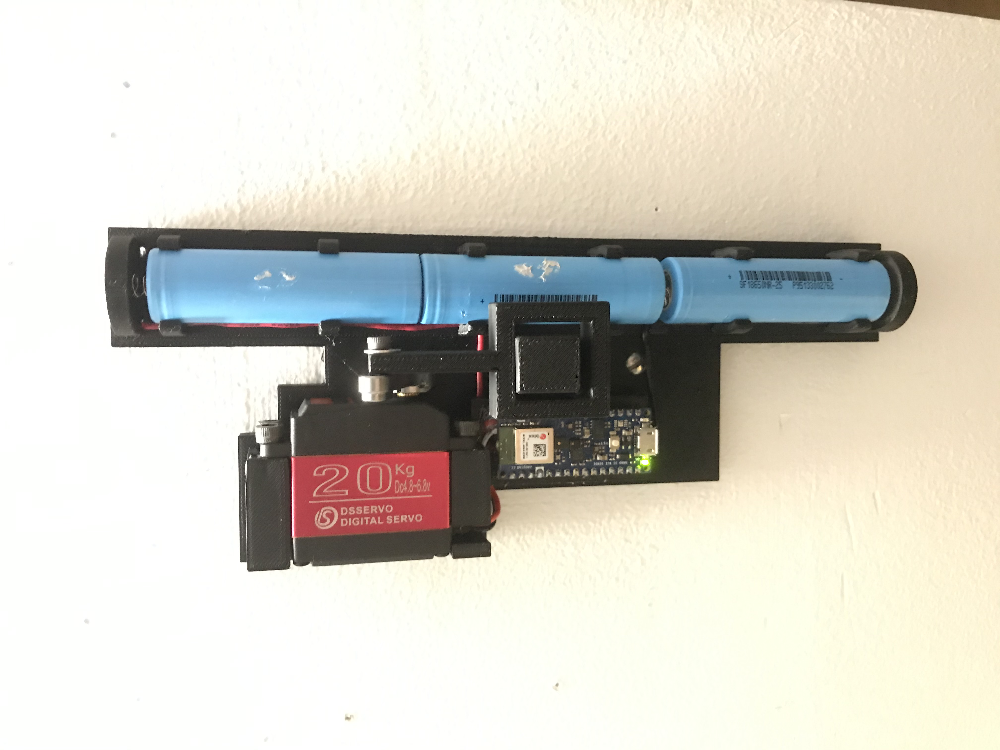

# Smart Light Switch Cover
In this project, I created a mechanical device that would flip the light switch at the press of a button. The body of the device was made out of 3D filament and I used an [Arduino Nano 33 BLE Sense](https://store-usa.arduino.cc/products/arduino-nano-33-ble-sense) for the microcontroller. I chose this microcontroller because it has built-in bluetooth, which allows me to communicate with the device wirelessly. I wanted to make this because I wanted a way to turn the lights off when I'm in bed.

## Sketching

I started by drawing some quick sketckes to give me a rough idea of how it would work and what it would look like. Once I got a good idea of what it looks like, I bought the necessary materials that I need to CAD, such as the arduino, servo, battery, battery springs, etc.

<figcaption align = "center"><b>Light Switch Rough Sketch</b></figcaption>

## CADing

After sketching, I started to make a CAD model in SolidWorks. I started by creating the servo, battery, and arduino model using a caliper. This is important because it makes it easier to build CAD models 

### Mounts
Then I made the body to connect everything together. I started by creating the holes and dimensions of an acutal light switch cover and modified it fit all the components. 

**Battery Mount**  

At first I designed the battery mount for 3 double AA batteries. However, as I was prototyping, I realized that it could only power the arduino and servo for about a day. I underestimated the amount of power bluetooth consumes. I then switched to three Samsung 18650s, which provided a higher operating voltage and current capacity.     

The battery mount had two main components to the battery holder. The first is a 3D printed housing for the battery springs and the other is the clips that hold the batteries in place. By combining multiple of these items, I created a battery holder that can fit three 18650 batteries.

<figcaption align = "center"><b>Battery Mount</b></figcaption>

**Arduino Mount**  
The arduino monut was straightforward to cad. I began by extruding a box with the top open to store all the wires. Then I created a hole on the side to connect the servo and battery to the arduino. The transparant part in the picture below is a representation of an Arduino Nano. In the second photo, you can see three holes for wires that connect to the servo and battery terminals.

<figcaption align = "center"><b>Arduino Mount with Arduino Placement</b></figcaption>

<figcaption align = "center"><b>Arduino Mount Showing Holes</b></figcaption>

**Servo Mount**  
I created the servo mount by creating two identical towers in which some bolts can be attached to. I designed the holes just a bit smaller than the bolt size because I will be using threaded inserts for a nice finish.

<figcaption align = "center"><b>Servo Mount</b></figcaption>

**Lever Arm**  
The lever arm connects the servo to the light switch. I started by making an extension to the light switch. I did this because it would make it easier to connect it to the servo and it would also take less force (and less energy) because there would be a greater torque the longer the lever arm is.    

Combining all of the pieces together and some rendering time later, we get the final product below!

<figcaption align = "center"><b>Final Render</b></figcaption>

## 3D Printing and Prototyping
I used the 3D printer a lot for this project, especially for prototyping. It was really helpful in visualizing how it would work and make any necessary changes to make it work better. For example, my first prototype used three double AA batteries and when I ran a power comsumption test by leaving it on and measuring the voltage, I found that it didn't last long.

<figcaption align = "center"><b>Printing of Light Switch Cover</b></figcaption>

<figcaption align = "center"><b>Prototype Design</b></figcaption>

## Coding

**Audio Reactive**  
My original goal was to be able to create a smart light cover that reacts to clapping so that when it detects a clap, it would turn the lights on and off. However, for reasons that I will explain later I decided to scrape that idea. To get started, I installed the necessary libraries: [PDM](https://www.arduino.cc/en/Reference/PDM) and [Servo](https://www.arduino.cc/reference/en/libraries/servo/). PDM allows you to use the on-board microphone and the Servo library allows you to control servos motors. I used some example code (PDMSerialPlotter) provided by the PDM library as a starting point. This code essentially receives audio samples from the microphone and plots them over time. From there I created a conditional statement saying that if the noise level gets above a certain threshold, it should tell the servo to move and turn the light on or off. The only problem with using noise level to determine a clap is that any loud sound can trigger the device and creating a complex algorithim to detect if a sound is a clap in Arduino is beyond the scope of my knowledge. However, it could be a good project to work on in the future. Due to these reasons, I decided to just do a button. You can this in action in the video below!
<iframe
    width="640"
    height="480"
    src="https://youtu.be/ERiFV8WuMkw"
    frameborder="0"
    allow="autoplay; encrypted-media"
    allowfullscreen
>
</iframe>

**Remote**  
My second best option of communicating with the Arduino is bluetooth! Again, I used the example code made by [Forward Computing and Control](http://www.forward.com.au/) that I found online. It had a good implementation of receiving and sending data through bluetooth. I wrote some additional code so that when the Arduino receives a command "on" or "off" it would move the servo to the on or off position.

## Finished Product
Below are some videos and pictures of the final product!

<figcaption align = "center"><b></b></figcaption>

<figcaption align = "center"><b></b></figcaption>

<iframe
    width="640"
    height="480"
    src="https://youtu.be/1pC7Z8tFiIY"
    frameborder="0"
    allow="autoplay; encrypted-media"
    allowfullscreen
>
</iframe>
<iframe
    width="640"
    height="480"
    src="https://youtu.be/2Zgz1dkdTes"
    frameborder="0"
    allow="autoplay; encrypted-media"
    allowfullscreen
>
</iframe>
<iframe
    width="640"
    height="480"
    src="https://youtu.be/mjP87SCtVcc"
    frameborder="0"
    allow="autoplay; encrypted-media"
    allowfullscreen
>
</iframe>

## Final Remarks

I loved working on this project! I really enjoyed learning and how to use bluetooth because I have many devices such as my earbuds or headphones that use bluetooth transmit sound and I always wondered how they work! Some things that can still be refined further are the battery mount and how I can communicate with the Arduino. During prototyping, I found that the battery clamps were not flexible enough, so when you try to take out the battery with force, it just snaps. I wonder if using ABS instead of PLA would solve this problem. The other thing that I can implement is communication through sound, like with a Google Home or Amazon Alexa.  